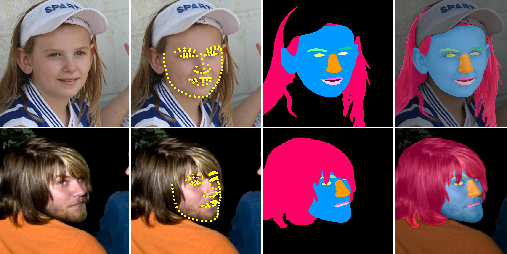

# Lapa-dataset
[[paper]](https://arxiv.org/abs/1907.11922)

**lapa dataset** is a large-scale face image dataset that has 20,000 high-resolution face images and their segmentation label,and 106 landmarks. 
The masks of Lapa were manually-annotated with  11 classes including  skin, nose, left eye,right eye, left eyebrows, right eyebrows, inner mouth, upper lip, lower lip, hair and background

## Sample Images

## Dataset Downloads
JDbox links：

[train](http://box.jd.com/sharedInfo/60EC4BD2CD7A4466)   
[val](http://box.jd.com/sharedInfo/42783B3F65757721)   
[test](http://box.jd.com/sharedInfo/BD6A0973B7814A29)
